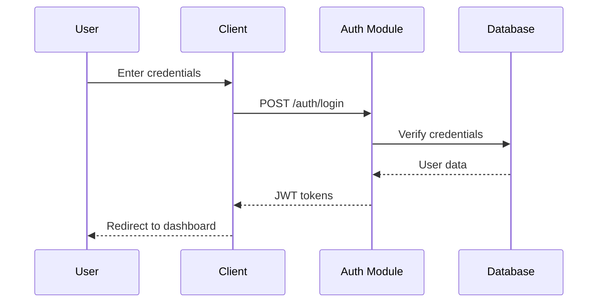
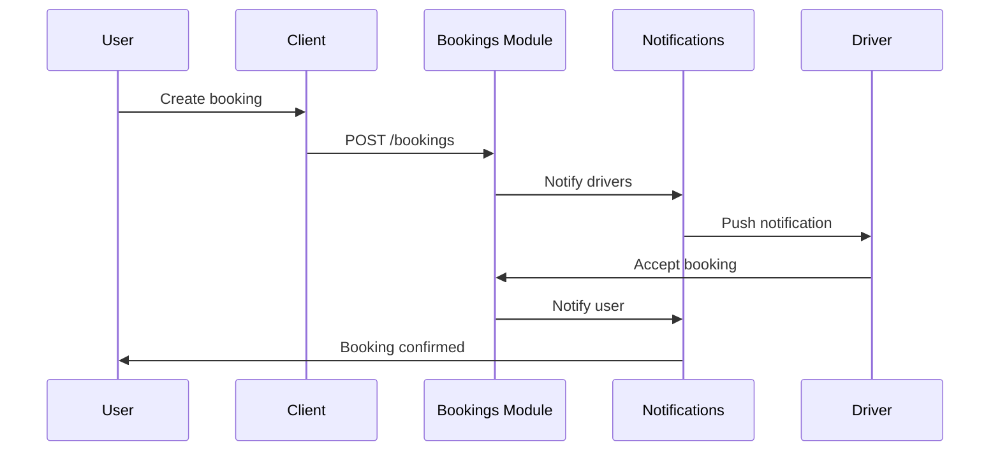

## System Overview

Trash2Treasure follows a modern microservices-inspired architecture with a clear separation between frontend and backend.

```
┌─────────────────────────────────────────────────────────────────┐
│                         Client Layer                             │
│  ┌─────────────┐  ┌─────────────┐  ┌─────────────────────────┐  │
│  │  User App   │  │ Driver App  │  │      Admin Panel        │  │
│  │  (Next.js)  │  │  (Next.js)  │  │       (Next.js)         │  │
│  └─────────────┘  └─────────────┘  └─────────────────────────┘  │
└─────────────────────────────────────────────────────────────────┘
                              │
                              ▼
┌─────────────────────────────────────────────────────────────────┐
│                        API Gateway                               │
│                    (NestJS REST API)                            │
│  ┌──────────┐ ┌──────────┐ ┌──────────┐ ┌──────────┐           │
│  │   Auth   │ │ Bookings │ │  Users   │ │  Admin   │           │
│  │  Module  │ │  Module  │ │  Module  │ │  Module  │           │
│  └──────────┘ └──────────┘ └──────────┘ └──────────┘           │
│  ┌──────────┐ ┌──────────┐ ┌──────────┐                        │
│  │  Chat    │ │Notifica- │ │  Public  │                        │
│  │  Module  │ │  tions   │ │  Module  │                        │
│  └──────────┘ └──────────┘ └──────────┘                        │
└─────────────────────────────────────────────────────────────────┘
                              │
                              ▼
┌─────────────────────────────────────────────────────────────────┐
│                       Data Layer                                 │
│  ┌─────────────────┐              ┌─────────────────┐           │
│  │   PostgreSQL    │              │  In-Memory      │           │
│  │   (Prisma ORM)  │              │    Cache        │           │
│  └─────────────────┘              └─────────────────┘           │
└─────────────────────────────────────────────────────────────────┘
```

## Tech Stack

### Frontend

| Technology     | Purpose                         |
| -------------- | ------------------------------- |
| Next.js 14     | React framework with App Router |
| TypeScript     | Type-safe JavaScript            |
| Tailwind CSS   | Utility-first CSS               |
| TanStack Query | Server state management         |
| Lucide React   | Icon library                    |

### Backend

| Technology           | Purpose                 |
| -------------------- | ----------------------- |
| NestJS               | Node.js framework       |
| Prisma               | ORM for database access |
| PostgreSQL           | Primary database        |
| NestJS Cache Manager | In-memory caching       |
| JWT                  | Authentication tokens   |

## Data Flow

### User Authentication Flow



### Booking Flow



## Module Structure

### Server Modules

<CardGroup cols={2}>
  <Card title="Auth Module" icon="lock">
    Handles user authentication, JWT tokens, and OTP verification.
  </Card>
  <Card title="Users Module" icon="users">
    User profile management and user listing for admins.
  </Card>
  <Card title="Bookings Module" icon="calendar">
    Booking CRUD operations and pickup management.
  </Card>
  <Card title="Admin Module" icon="shield">
    Admin-specific operations, stats, and management.
  </Card>
  <Card title="Notifications Module" icon="bell">
    Push notifications and in-app notification management.
  </Card>
  <Card title="Chat Module" icon="message">
    Real-time messaging and chat support between users and drivers.
  </Card>
</CardGroup>

### Client Structure

```
client/
├── app/                    # Next.js App Router
│   ├── (auth)/            # Auth layout group
│   │   ├── login/
│   │   ├── signup/
│   │   └── verify/
│   ├── admin/             # Admin pages
│   ├── driver/            # Driver pages
│   └── users/             # User pages
├── components/
│   ├── auth/              # Auth components
│   ├── layout/            # Layout components
│   ├── shared/            # Shared components
│   └── ui/                # UI primitives
└── lib/
    ├── api.ts             # API client
    ├── auth.ts            # Auth utilities
    └── types.ts           # TypeScript types
```

## Security

### Authentication

- JWT access tokens (15 min expiry)
- JWT refresh tokens (7 day expiry)
- HTTP-only cookies for token storage
- OTP verification for sensitive operations

### Authorization

- Role-based access control (RBAC)
- Route guards on both client and server
- API endpoint protection with JWT guards

### Data Protection

- Password hashing with bcrypt
- Input validation with class-validator
- SQL injection protection via Prisma
- XSS protection via React

## Scalability Considerations

- **Stateless API**: All state stored in database
- **Caching**: In-memory cache for frequently accessed data
- **Database**: Prisma supports connection pooling
- **Docker**: Easy horizontal scaling with containers
