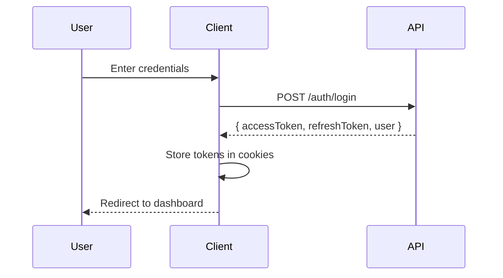

## Overview

The client implements JWT-based authentication with automatic token refresh and role-based access control.

## Auth Flow



## AuthProvider

The `AuthProvider` component manages authentication state:

```tsx
// components/auth/auth-provider.tsx
"use client";

import { createContext, useContext, useState, useEffect } from "react";

interface AuthContext {
  user: User | null;
  isAuthenticated: boolean;
  isLoading: boolean;
  login: (email: string, password: string) => Promise<void>;
  logout: () => void;
}

const AuthContext = createContext<AuthContext | null>(null);

export function AuthProvider({ children }) {
  const [user, setUser] = useState<User | null>(null);
  const [isLoading, setIsLoading] = useState(true);

  useEffect(() => {
    // Check for existing session on mount
    checkAuth();
  }, []);

  return (
    <AuthContext.Provider
      value={{ user, isAuthenticated: !!user, isLoading, login, logout }}
    >
      {children}
    </AuthContext.Provider>
  );
}

export function useAuth() {
  const context = useContext(AuthContext);
  if (!context) throw new Error("useAuth must be used within AuthProvider");
  return context;
}
```

## Using Auth Hook

```tsx
"use client";

import { useAuth } from "@/components/auth/auth-provider";

export default function ProfilePage() {
  const { user, logout } = useAuth();

  return (
    <div>
      <h1>Welcome, {user?.fullName}</h1>
      <p>Email: {user?.email}</p>
      <p>Role: {user?.role}</p>
      <Button onClick={logout}>Logout</Button>
    </div>
  );
}
```

## RequireAuth Component

Protects routes based on authentication and role:

```tsx
// components/auth/require-auth.tsx
"use client";

import { useAuth } from "./auth-provider";
import { redirect } from "next/navigation";

interface RequireAuthProps {
  children: React.ReactNode;
  allowedRoles?: ("USER" | "ADMIN" | "DRIVER")[];
}

export function RequireAuth({ children, allowedRoles }: RequireAuthProps) {
  const { user, isLoading, isAuthenticated } = useAuth();

  if (isLoading) {
    return <LoadingSpinner />;
  }

  if (!isAuthenticated) {
    redirect("/login");
  }

  if (allowedRoles && !allowedRoles.includes(user.role)) {
    redirect("/unauthorized");
  }

  return <>{children}</>;
}
```

## Usage in Layouts

```tsx
// app/users/layout.tsx
import { RequireAuth } from "@/components/auth/require-auth";

export default function UserLayout({ children }) {
  return <RequireAuth allowedRoles={["USER"]}>{children}</RequireAuth>;
}

// app/admin/layout.tsx
export default function AdminLayout({ children }) {
  return <RequireAuth allowedRoles={["ADMIN"]}>{children}</RequireAuth>;
}
```

## Login Flow

```tsx
// app/login/page.tsx
"use client";

import { useState } from "react";
import { useRouter } from "next/navigation";
import { api } from "@/lib/api";

export default function LoginPage() {
  const router = useRouter();
  const [email, setEmail] = useState("");
  const [password, setPassword] = useState("");
  const [error, setError] = useState("");

  const handleSubmit = async (e: React.FormEvent) => {
    e.preventDefault();
    try {
      const { user } = await api.login({ email, password });

      // Redirect based on role
      switch (user.role) {
        case "ADMIN":
          router.push("/admin/dashboard");
          break;
        case "DRIVER":
          router.push("/driver/dashboard");
          break;
        default:
          router.push("/users/dashboard");
      }
    } catch (err) {
      setError("Invalid credentials");
    }
  };

  return (
    <form onSubmit={handleSubmit}>
      <Input
        type="email"
        value={email}
        onChange={(e) => setEmail(e.target.value)}
        placeholder="Email"
      />
      <Input
        type="password"
        value={password}
        onChange={(e) => setPassword(e.target.value)}
        placeholder="Password"
      />
      {error && <p className="text-red-500">{error}</p>}
      <Button type="submit">Login</Button>
    </form>
  );
}
```

## Token Refresh

The API client automatically refreshes tokens:

```tsx
// lib/api.ts
export async function apiFetch<T>(
  path: string,
  options?: RequestInit,
): Promise<T> {
  const response = await fetch(`${API_URL}${path}`, {
    ...options,
    credentials: "include", // Include cookies
  });

  if (response.status === 401) {
    // Try to refresh token
    const refreshed = await refreshTokens();
    if (refreshed) {
      // Retry original request
      return apiFetch(path, options);
    }
    // Redirect to login
    window.location.href = "/login";
  }

  return response.json();
}
```

## Role-Based UI

Show/hide elements based on role:

```tsx
const { user } = useAuth();

return (
  <div>
    {user?.role === "ADMIN" && <Link href="/admin/dashboard">Admin Panel</Link>}

    {user?.role === "DRIVER" && <Link href="/driver/bookings">My Pickups</Link>}

    {user?.role === "USER" && (
      <Link href="/users/bookings/new">Book Pickup</Link>
    )}
  </div>
);
```

## Logout

```tsx
const { logout } = useAuth();

const handleLogout = async () => {
  await api.logout();
  logout();
  router.push("/login");
};
```
