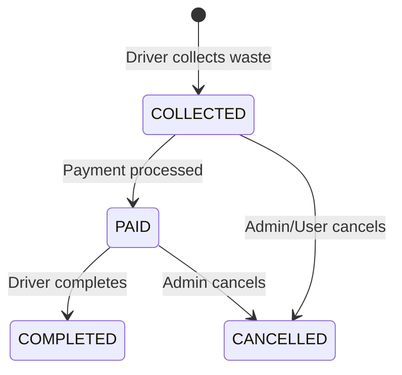

## Overview

The Driver Bookings page (`/driver/bookings`) shows all bookings assigned to the driver with filtering and status management.

## Features

- View all assigned bookings
- Filter by status and date
- Update pickup status
- Record actual weight
- Complete pickups

## Bookings List

```tsx
// app/driver/bookings/page.tsx
"use client";

import { useState } from "react";
import { useQuery } from "@tanstack/react-query";
import { apiFetch } from "@/lib/api";

export default function DriverBookingsPage() {
  const [filter, setFilter] = useState("all");

  const { data } = useQuery({
    queryKey: ["driver", "bookings", filter],
    queryFn: () => apiFetch(`/driver/bookings?status=${filter}`),
  });

  return (
    <div className="space-y-6">
      <h1>My Bookings</h1>

      {/* Filter Tabs */}
      <Tabs value={filter} onValueChange={setFilter}>
        <TabsList>
          <TabsTrigger value="all">All</TabsTrigger>
          <TabsTrigger value="COLLECTED">Collected</TabsTrigger>
          <TabsTrigger value="PAID">Paid</TabsTrigger>
          <TabsTrigger value="COMPLETED">Completed</TabsTrigger>
        </TabsList>
      </Tabs>

      {/* Bookings */}
      <div className="space-y-4">
        {data?.items.map((booking) => (
          <BookingCard key={booking.id} booking={booking} />
        ))}

        {data?.items.length === 0 && (
          <Card>
            <p className="text-center text-muted">No bookings found</p>
          </Card>
        )}
      </div>
    </div>
  );
}
```

## Booking Card

```tsx
function BookingCard({ booking }) {
  const [showCompleteModal, setShowCompleteModal] = useState(false);

  const startMutation = useMutation({
    mutationFn: () =>
      apiFetch(`/driver/bookings/${booking.id}/start`, {
        method: "POST",
      }),
  });

  return (
    <Card>
      <div className="flex justify-between items-start">
        <div>
          <div className="flex items-center gap-2">
            <h3 className="font-medium">{booking.wasteCategory?.name}</h3>
            <StatusPill status={booking.status} />
          </div>
          <p className="text-sm text-muted mt-1">{booking.address}</p>
        </div>
        <p className="text-sm">
          {new Date(booking.scheduledDate).toLocaleDateString()}
        </p>
      </div>

      <div className="mt-4 grid grid-cols-3 gap-4 text-sm">
        <div>
          <p className="text-muted">Estimated Weight</p>
          <p>{booking.estimatedWeightRange}</p>
        </div>
        <div>
          <p className="text-muted">Estimated Amount</p>
          <p>LKR {booking.estimatedMaxAmount}</p>
        </div>
        <div>
          <p className="text-muted">User</p>
          <p>{booking.user?.fullName}</p>
        </div>
      </div>

      {/* Actions */}
      <div className="mt-4 flex gap-2">
        {booking.status === "COLLECTED" && (
          <Button onClick={() => startMutation.mutate()}>Mark as Paid</Button>
        )}

        {booking.status === "PAID" && (
          <Button onClick={() => setShowCompleteModal(true)}>
            Complete Pickup
          </Button>
        )}

        <Button variant="outline" onClick={() => openMaps(booking.address)}>
          📍 Navigate
        </Button>

        <Button
          variant="ghost"
          onClick={() => window.open(`tel:${booking.user?.phone}`)}
        >
          📞 Call
        </Button>
      </div>

      {showCompleteModal && (
        <CompletePickupModal
          booking={booking}
          onClose={() => setShowCompleteModal(false)}
        />
      )}
    </Card>
  );
}
```

## Complete Pickup Modal

```tsx
function CompletePickupModal({ booking, onClose }) {
  const [actualWeight, setActualWeight] = useState(booking.estimatedWeightKg);
  const [notes, setNotes] = useState("");

  const mutation = useMutation({
    mutationFn: (data) =>
      apiFetch(`/driver/bookings/${booking.id}/complete`, {
        method: "POST",
        body: JSON.stringify(data),
      }),
    onSuccess: () => {
      toast({ title: "Pickup completed successfully" });
      onClose();
    },
  });

  const finalAmount =
    (actualWeight *
      ((booking.wasteCategory?.maxPriceLkrPerKg || 60) +
        (booking.wasteCategory?.minPriceLkrPerKg || 40))) /
    2;

  return (
    <Dialog open onOpenChange={onClose}>
      <DialogContent>
        <DialogHeader>
          <DialogTitle>Complete Pickup</DialogTitle>
        </DialogHeader>

        <div className="space-y-4">
          <div>
            <Label>Actual Weight (kg)</Label>
            <Input
              type="number"
              value={actualWeight}
              onChange={(e) => setActualWeight(+e.target.value)}
              step="0.1"
            />
          </div>

          <div className="bg-muted p-4 rounded-lg">
            <p className="text-sm text-muted">Final Amount</p>
            <p className="text-2xl font-bold">LKR {finalAmount.toFixed(2)}</p>
            <p className="text-xs text-muted">
              {actualWeight} kg × LKR{" "}
              {((booking.wasteCategory?.maxPriceLkrPerKg || 60) +
                (booking.wasteCategory?.minPriceLkrPerKg || 40)) /
                2}
              /kg (average)
            </p>
          </div>

          <div>
            <Label>Notes (optional)</Label>
            <Textarea
              value={notes}
              onChange={(e) => setNotes(e.target.value)}
              placeholder="Any notes about the pickup"
            />
          </div>

          <Button
            onClick={() =>
              mutation.mutate({ actualWeightKg: actualWeight, notes })
            }
            disabled={mutation.isPending}
            className="w-full"
          >
            {mutation.isPending ? "Processing..." : "Complete & Submit"}
          </Button>
        </div>
      </DialogContent>
    </Dialog>
  );
}
```

## Pickup Status Flow



## Driver Booking Actions

| Status    | Available Actions                 |
| --------- | --------------------------------- |
| COLLECTED | Mark as Paid, Navigate, Call User |
| PAID      | Complete, Navigate, Call User     |
| COMPLETED | View Details                      |
| CANCELLED | View Details                      |

## Related Pages

<CardGroup cols={2}>
  <Card
    title="Dashboard"
    icon="chart-line"
    href="/client/pages/driver-dashboard"
  >
    Return to dashboard.
  </Card>
</CardGroup>
