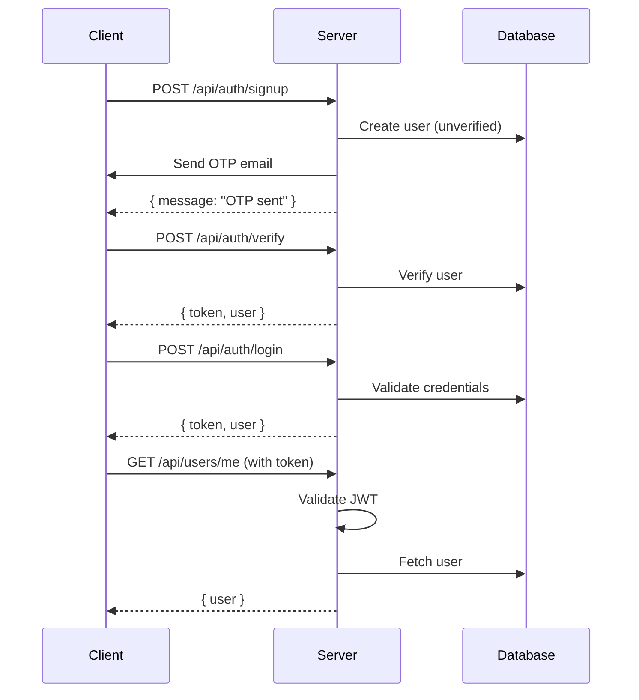

## Overview

Trash2Cash uses JWT (JSON Web Tokens) for authentication with role-based access control.

## Authentication Flow



## JWT Strategy

JWT tokens are extracted from the `Authorization: Bearer <token>` header and validated using Passport.

```typescript
// src/auth/jwt.strategy.ts
@Injectable()
export class JwtStrategy extends PassportStrategy(Strategy) {
  constructor(
    private config: ConfigService,
    private prisma: PrismaService,
  ) {
    super({
      jwtFromRequest: ExtractJwt.fromAuthHeaderAsBearerToken(),
      ignoreExpiration: false,
      secretOrKey: config.get("JWT_ACCESS_SECRET"),
    });
  }

  async validate(payload: { sub: string }) {
    const user = await this.prisma.user.findUnique({
      where: { id: payload.sub },
    });

    if (!user) {
      throw new UnauthorizedException();
    }

    return user;
  }
}
```

## Auth Service

The Auth Service handles all authentication operations including signup, login, OTP verification, and token refresh.

### Token Expiration

- **Access Token**: 15 minutes
- **Refresh Token**: 7 days

```typescript
// src/auth/auth.service.ts
@Injectable()
export class AuthService {
  constructor(
    private prisma: PrismaService,
    private jwt: JwtService,
    private config: ConfigService,
  ) {}

  async signup(dto: RegisterDto) {
    // Check if user already exists
    const exists = await this.prisma.user.findUnique({
      where: { email: dto.email },
    });

    if (exists) {
      throw new ConflictException("Email already registered");
    }

    // Hash password with bcrypt
    const passwordHash = await bcrypt.hash(dto.password, 10);

    // Generate 6-digit OTP
    const otp = Math.floor(100000 + Math.random() * 900000).toString();

    // Create user in database
    const user = await this.prisma.user.create({
      data: {
        email: dto.email,
        passwordHash,
        role: Role.CUSTOMER,
      },
    });

    // Send OTP to email for verification
    await this.sendOtpEmail(user.email, otp);

    return { message: "Verification OTP sent to email", userId: user.id };
  }

  async login(dto: LoginDto) {
    const user = await this.prisma.user.findUnique({
      where: { email: dto.email },
    });

    if (!user) {
      throw new UnauthorizedException("Invalid credentials");
    }

    const valid = await bcrypt.compare(dto.password, user.passwordHash);

    if (!valid) {
      throw new UnauthorizedException("Invalid credentials");
    }

    const tokens = this.generateTokens(user.id);

    return {
      user: this.sanitizeUser(user),
      ...tokens,
    };
  }

  async verifyOtp(dto: VerifyOtpDto) {
    const user = await this.prisma.user.findUnique({
      where: { email: dto.email },
    });

    if (!user) {
      throw new NotFoundException("User not found");
    }

    if (user.verificationOtp !== dto.otp) {
      throw new BadRequestException("Invalid OTP");
    }

    const verified = await this.prisma.user.update({
      where: { id: user.id },
      data: {
        isVerified: true,
        verificationOtp: null,
      },
    });

    const token = this.signToken(verified.id);

    return {
      token,
      user: this.excludePassword(verified),
    };
  }

  private signToken(userId: string): string {
    return this.jwt.sign({ sub: userId });
  }

  private excludePassword(user: User) {
    const { password, verificationOtp, ...rest } = user;
    return rest;
  }
}
```

## Auth Controller

```typescript
// src/auth/auth.controller.ts
@Controller("auth")
export class AuthController {
  constructor(private authService: AuthService) {}

  @Post("signup")
  signup(@Body() dto: SignupDto) {
    return this.authService.signup(dto);
  }

  @Post("login")
  login(@Body() dto: LoginDto) {
    return this.authService.login(dto);
  }

  @Post("verify")
  verify(@Body() dto: VerifyDto) {
    return this.authService.verifyEmail(dto);
  }

  @Post("resend-otp")
  resendOtp(@Body() dto: ResendOtpDto) {
    return this.authService.resendOtp(dto);
  }
}
```

## Guards

### JWT Auth Guard

```typescript
// src/common/guards/jwt-auth.guard.ts
import { Injectable, ExecutionContext } from "@nestjs/common";
import { AuthGuard } from "@nestjs/passport";
import { Reflector } from "@nestjs/core";
import { IS_PUBLIC_KEY } from "../decorators/public.decorator";

@Injectable()
export class JwtAuthGuard extends AuthGuard("jwt") {
  constructor(private reflector: Reflector) {
    super();
  }

  canActivate(context: ExecutionContext) {
    const isPublic = this.reflector.getAllAndOverride<boolean>(IS_PUBLIC_KEY, [
      context.getHandler(),
      context.getClass(),
    ]);

    if (isPublic) {
      return true;
    }

    return super.canActivate(context);
  }
}
```

### Roles Guard

```typescript
// src/common/guards/roles.guard.ts
import { Injectable, CanActivate, ExecutionContext } from "@nestjs/common";
import { Reflector } from "@nestjs/core";
import { Role } from "@prisma/client";
import { ROLES_KEY } from "../decorators/roles.decorator";

@Injectable()
export class RolesGuard implements CanActivate {
  constructor(private reflector: Reflector) {}

  canActivate(context: ExecutionContext): boolean {
    const requiredRoles = this.reflector.getAllAndOverride<Role[]>(ROLES_KEY, [
      context.getHandler(),
      context.getClass(),
    ]);

    if (!requiredRoles) {
      return true;
    }

    const { user } = context.switchToHttp().getRequest();
    return requiredRoles.includes(user.role);
  }
}
```

## Decorators

```typescript
// src/common/decorators/roles.decorator.ts
import { SetMetadata } from "@nestjs/common";
import { Role } from "@prisma/client";

export const ROLES_KEY = "roles";
export const Roles = (...roles: Role[]) => SetMetadata(ROLES_KEY, roles);

// src/common/decorators/public.decorator.ts
import { SetMetadata } from "@nestjs/common";

export const IS_PUBLIC_KEY = "isPublic";
export const Public = () => SetMetadata(IS_PUBLIC_KEY, true);

// src/common/decorators/current-user.decorator.ts
import { createParamDecorator, ExecutionContext } from "@nestjs/common";

export const CurrentUser = createParamDecorator(
  (data: unknown, ctx: ExecutionContext) => {
    const request = ctx.switchToHttp().getRequest();
    return request.user;
  },
);
```

## Usage Examples

### Protected Route

```typescript
@Controller("users")
@UseGuards(JwtAuthGuard)
export class UsersController {
  @Get("me")
  getProfile(@CurrentUser() user: User) {
    return user;
  }
}
```

### Role-Based Route

```typescript
@Controller("admin")
@UseGuards(JwtAuthGuard, RolesGuard)
@Roles(Role.ADMIN)
export class AdminController {
  @Get("dashboard")
  getDashboard() {
    return this.adminService.getDashboard();
  }
}
```

### Public Route

```typescript
@Controller("auth")
export class AuthController {
  @Public()
  @Post("login")
  login(@Body() dto: LoginDto) {
    return this.authService.login(dto);
  }
}
```

## Client-Side Token Storage

```typescript
// client/lib/auth.ts
export function setToken(token: string) {
  localStorage.setItem("token", token);
}

export function getToken(): string | null {
  if (typeof window === "undefined") return null;
  return localStorage.getItem("token");
}

export function removeToken() {
  localStorage.removeItem("token");
}
```

## Related Pages

<CardGroup cols={2}>
  <Card title="Client Auth" icon="shield" href="/client/authentication">
    Client-side authentication.
  </Card>
  <Card title="API Reference" icon="code" href="/api-reference/auth/login">
    Auth API endpoints.
  </Card>
</CardGroup>
