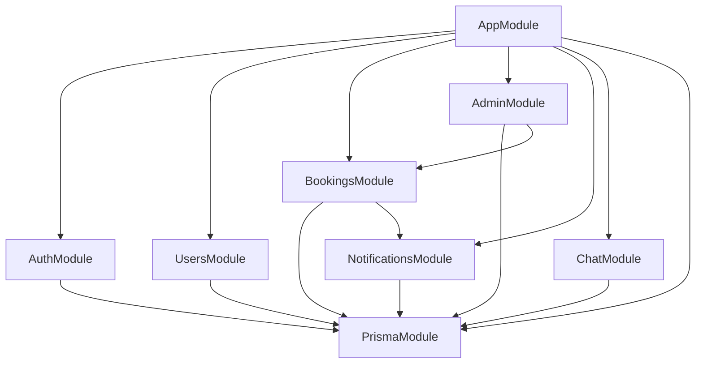

## Module Architecture

Trash2Cash follows a modular architecture where each feature is encapsulated in its own module with controllers, services, and DTOs.

## Auth Module

Handles user authentication and authorization.

```typescript
// src/auth/auth.module.ts
@Module({
  imports: [
    JwtModule.registerAsync({
      useFactory: (config: ConfigService) => ({
        secret: config.get("JWT_SECRET"),
        signOptions: { expiresIn: "7d" },
      }),
      inject: [ConfigService],
    }),
    PrismaModule,
  ],
  controllers: [AuthController],
  providers: [AuthService, JwtStrategy],
  exports: [AuthService, JwtModule],
})
export class AuthModule {}
```

### Auth Service Methods

| Method          | Description                 |
| --------------- | --------------------------- |
| `signup()`      | Register new user           |
| `login()`       | Authenticate and return JWT |
| `verifyEmail()` | Verify email with OTP       |
| `resendOtp()`   | Resend verification OTP     |

## Users Module

Manages user profiles and data.

```typescript
// src/users/users.module.ts
@Module({
  imports: [PrismaModule],
  controllers: [UsersController],
  providers: [UsersService],
  exports: [UsersService],
})
export class UsersModule {}
```

### Users Service Methods

| Method            | Description             |
| ----------------- | ----------------------- |
| `findById()`      | Get user by ID          |
| `findByEmail()`   | Get user by email       |
| `updateProfile()` | Update user profile     |
| `getDashboard()`  | Get user dashboard data |

## Bookings Module

Core module for waste pickup bookings.

```typescript
// src/bookings/bookings.module.ts
@Module({
  imports: [PrismaModule, NotificationsModule],
  controllers: [BookingsController, PickupsController],
  providers: [BookingsService],
  exports: [BookingsService],
})
export class BookingsModule {}
```

### Bookings Service Methods

| Method             | Description                 |
| ------------------ | --------------------------- |
| `create()`         | Create new booking          |
| `findAll()`        | List bookings with filters  |
| `findOne()`        | Get booking by ID           |
| `cancel()`         | Cancel a booking            |
| `assignDriver()`   | Assign driver to booking    |
| `startPickup()`    | Mark pickup started         |
| `completePickup()` | Complete pickup with weight |

## Admin Module

Administrative functions and management.

```typescript
// src/admin/admin.module.ts
@Module({
  imports: [PrismaModule, BookingsModule],
  controllers: [AdminController],
  providers: [AdminService],
})
export class AdminModule {}
```

### Admin Service Methods

| Method            | Description                |
| ----------------- | -------------------------- |
| `getDashboard()`  | Get admin dashboard stats  |
| `getUsers()`      | List all users             |
| `getDrivers()`    | List all drivers           |
| `getPricing()`    | Get waste category pricing |
| `updatePricing()` | Update pricing             |
| `assignDriver()`  | Assign booking to driver   |

## Notifications Module

Web push notifications using VAPID.

```typescript
// src/notifications/notifications.module.ts
@Module({
  imports: [PrismaModule],
  controllers: [NotificationsController],
  providers: [NotificationsService],
  exports: [NotificationsService],
})
export class NotificationsModule {}
```

### Notifications Service Methods

| Method          | Description             |
| --------------- | ----------------------- |
| `subscribe()`   | Store push subscription |
| `unsubscribe()` | Remove subscription     |
| `send()`        | Send push notification  |
| `getHistory()`  | Get user notifications  |

## Chat Module

AI-powered chat assistant.

```typescript
// src/chat/chat.module.ts
@Module({
  imports: [PrismaModule],
  controllers: [ChatController],
  providers: [ChatService],
})
export class ChatModule {}
```

### Chat Service Methods

| Method          | Description                      |
| --------------- | -------------------------------- |
| `sendMessage()` | Process user message and respond |
| `getHistory()`  | Get chat history                 |

## Common Module

Shared utilities and decorators.

### Guards

```typescript
// src/common/guards/jwt-auth.guard.ts
@Injectable()
export class JwtAuthGuard extends AuthGuard("jwt") {}

// src/common/guards/roles.guard.ts
@Injectable()
export class RolesGuard implements CanActivate {
  canActivate(context: ExecutionContext): boolean {
    const requiredRoles = this.reflector.getAllAndOverride<Role[]>(ROLES_KEY, [
      context.getHandler(),
      context.getClass(),
    ]);
    const { user } = context.switchToHttp().getRequest();
    return requiredRoles.includes(user.role);
  }
}
```

### Decorators

```typescript
// src/common/decorators/current-user.decorator.ts
export const CurrentUser = createParamDecorator(
  (data: unknown, ctx: ExecutionContext) => {
    const request = ctx.switchToHttp().getRequest();
    return request.user;
  },
);

// src/common/decorators/roles.decorator.ts
export const Roles = (...roles: Role[]) => SetMetadata(ROLES_KEY, roles);
```

### Exception Filters

```typescript
// src/common/filters/http-exception.filter.ts
@Catch(HttpException)
export class HttpExceptionFilter implements ExceptionFilter {
  catch(exception: HttpException, host: ArgumentsHost) {
    const ctx = host.switchToHttp();
    const response = ctx.getResponse<Response>();
    const status = exception.getStatus();

    response.status(status).json({
      statusCode: status,
      message: exception.message,
      timestamp: new Date().toISOString(),
    });
  }
}
```

## Module Dependencies



## Related Pages

<CardGroup cols={2}>
  <Card title="Database" icon="database" href="/server/prisma-database">
    Prisma schema and models.
  </Card>
  <Card title="Authentication" icon="lock" href="/server/authentication">
    JWT authentication details.
  </Card>
</CardGroup>
