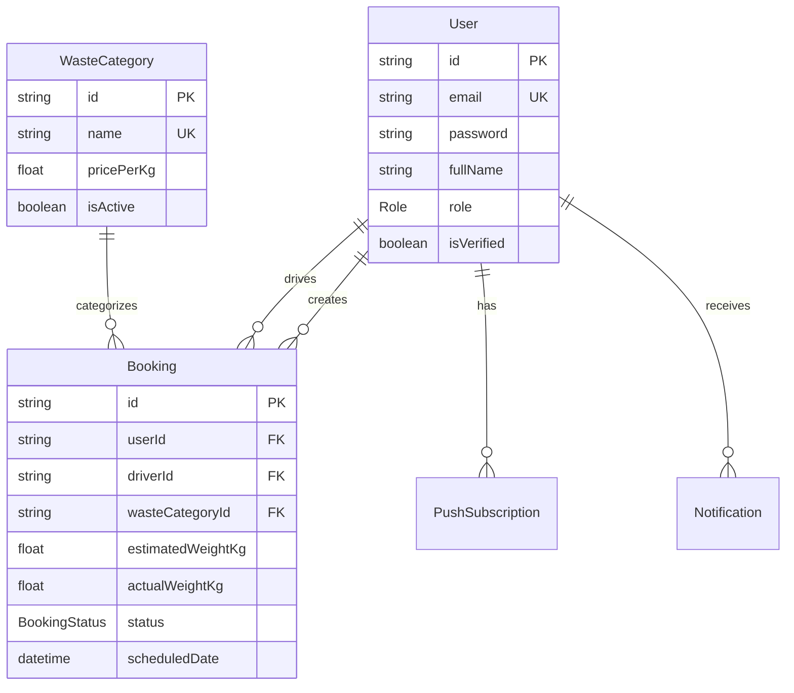

## Overview

Trash2Cash uses [Prisma](https://www.prisma.io/) as the ORM with PostgreSQL as the database.

## Prisma Setup

```typescript
// src/prisma/prisma.service.ts
import { Injectable, OnModuleInit, OnModuleDestroy } from "@nestjs/common";
import { PrismaClient } from "@prisma/client";

@Injectable()
export class PrismaService
  extends PrismaClient
  implements OnModuleInit, OnModuleDestroy
{
  async onModuleInit() {
    await this.$connect();
  }

  async onModuleDestroy() {
    await this.$disconnect();
  }
}
```

## Database Schema

Trash2Cash uses a comprehensive Prisma schema with the following core models:

### User Model

The base user model, role-specific profiles are linked via one-to-one relations.

```prisma
model User {
  id                 String              @id @default(uuid())
  email              String              @unique
  passwordHash       String?
  refreshTokenHash   String?
  role               Role                @default(CUSTOMER)
  createdAt          DateTime            @default(now())

  customer           Customer?
  admin              Admin?
  driver             Driver?
  bookings           Booking[]
  notifications      Notification[]
  passkeyCredentials PasskeyCredential[]
  userPermissions    UserPermission[]
  recycler           Recycler?
  corporate          Corporate?
}

enum Role {
  CUSTOMER
  ADMIN
  SUPER_ADMIN
  DRIVER
  RECYCLER
  CORPORATE
}
```

### Role-Specific Profiles

Each role has a dedicated profile (one-to-one with User):

```prisma
model Customer {
  id        String         @id
  fullName  String
  phone     String
  address   String?
  avatarUrl String?
  type      CustomerType   @default(HOUSEHOLD)
  status    CustomerStatus @default(ACTIVE)
  createdAt DateTime       @default(now())
  user      User           @relation(fields: [id], references: [id], onDelete: Cascade)
}

model Driver {
  id          String       @id
  fullName    String
  phone       String
  rating      Float        @default(0)
  pickupCount Int          @default(0)
  vehicle     String
  status      DriverStatus @default(OFFLINE)
  avatarUrl   String?
  createdAt   DateTime     @default(now())
  user        User         @relation(fields: [id], references: [id], onDelete: Cascade)
  bookings    Booking[]
}

model Admin {
  id       String  @id
  fullName String
  phone    String
  address  String?
  avatarUrl String?
  approved Boolean @default(false)
  user     User    @relation(fields: [id], references: [id], onDelete: Cascade)
}

enum DriverStatus {
  ONLINE
  OFFLINE
  ON_PICKUP
}

enum CustomerStatus {
  ACTIVE
  INACTIVE
}

enum CustomerType {
  HOUSEHOLD
  BUSINESS
}
```

### Booking Model

Represents waste pickup bookings.

```prisma
model Booking {
  id                   String               @id @default(uuid())
  userId               String
  wasteCategoryId      String
  estimatedWeightRange String
  estimatedMinAmount   Float
  estimatedMaxAmount   Float
  addressLine1         String
  city                 String
  postalCode           String
  specialInstructions  String?
  scheduledDate        DateTime
  scheduledTimeSlot    String
  actualWeightKg       Float?
  finalAmountLkr       Float?
  driverId             String?
  createdAt            DateTime             @default(now())
  status               BookingStatus        @default(SCHEDULED)

  driver               Driver?              @relation(fields: [driverId], references: [id])
  user                 User                 @relation(fields: [userId], references: [id])
  wasteCategory        WasteCategory        @relation(fields: [wasteCategoryId], references: [id])
  transactions         PaymentTransaction[]
}

enum BookingStatus {
  SCHEDULED
  COLLECTED
  PAID
  COMPLETED
  CANCELLED
  REFUNDED
}
```

### Waste Category & Pricing

```prisma
model WasteCategory {
  id          String    @id @default(uuid())
  name        String    @unique
  description String?
  isActive    Boolean   @default(true)
  bookings    Booking[]
  pricing     Pricing?
}

model Pricing {
  id               String        @id @default(uuid())
  wasteCategoryId  String        @unique
  minPriceLkrPerKg Float
  maxPriceLkrPerKg Float
  updatedAt        DateTime      @updatedAt
  isActive         Boolean       @default(true)
  wasteCategory    WasteCategory @relation(fields: [wasteCategoryId], references: [id])
}
```

### Notification & Payment Models

```prisma
model Notification {
  id        String            @id @default(uuid())
  userId    String?
  title     String
  message   String
  isRead    Boolean           @default(false)
  level     NotificationLevel @default(INFO)
  createdAt DateTime          @default(now())
  user      User?             @relation(fields: [userId], references: [id])
}

enum NotificationLevel {
  INFO
  SUCCESS
  WARNING
  ERROR
}

model PaymentTransaction {
  id        String        @id @default(uuid())
  bookingId String
  amountLkr Float
  createdAt DateTime      @default(now())
  method    PaymentMethod
  status    PaymentStatus @default(PROCESSED)
  booking   Booking       @relation(fields: [bookingId], references: [id])
}

enum PaymentMethod {
  MOBILE_WALLET
  BANK
}

enum PaymentStatus {
  PROCESSED
  FAILED
}
```

### Passkey / WebAuthn

```prisma
model PasskeyCredential {
  id                  String   @id @default(uuid())
  userId              String
  credentialId        String   @unique
  credentialPublicKey Bytes
  counter             BigInt   @default(0)
  transports          String[] @default([])
  deviceName          String   @default("Passkey")
  createdAt           DateTime @default(now())
  user                User     @relation(fields: [userId], references: [id], onDelete: Cascade)

  @@index([userId])
}
```

## Entity Relationship Diagram



## Migrations

### Generate Migration

```bash
npx prisma migrate dev --name migration_name
```

### Apply Migrations

```bash
npx prisma migrate deploy
```

### Reset Database

```bash
npx prisma migrate reset
```

## Seeding

```typescript
// prisma/seed.ts
import { PrismaClient } from "@prisma/client";
import * as bcrypt from "bcrypt";

const prisma = new PrismaClient();

async function main() {
  // Create waste categories
  const categories = [
    { name: "Plastic", pricePerKg: 50.0 },
    { name: "Paper", pricePerKg: 30.0 },
    { name: "Metal", pricePerKg: 100.0 },
    { name: "Glass", pricePerKg: 25.0 },
    { name: "E-Waste", pricePerKg: 150.0 },
  ];

  for (const cat of categories) {
    await prisma.wasteCategory.upsert({
      where: { name: cat.name },
      update: {},
      create: cat,
    });
  }

  // Create admin user
  const adminPassword = await bcrypt.hash("admin123", 10);
  await prisma.user.upsert({
    where: { email: "admin@trash2cash.lk" },
    update: {},
    create: {
      email: "admin@trash2cash.lk",
      password: adminPassword,
      fullName: "Admin User",
      role: "ADMIN",
      isVerified: true,
    },
  });

  console.log("Seeding complete!");
}

main()
  .catch(console.error)
  .finally(() => prisma.$disconnect());
```

Run seeding:

```bash
npx prisma db seed
```

## Prisma Studio

Launch visual database browser:

```bash
npx prisma studio
```

## Query Examples

### Find with Relations

```typescript
const booking = await this.prisma.booking.findUnique({
  where: { id },
  include: {
    user: { select: { fullName: true, email: true, phone: true } },
    driver: { select: { fullName: true, phone: true } },
    wasteCategory: true,
  },
});
```

### Filter and Paginate

```typescript
const bookings = await this.prisma.booking.findMany({
  where: {
    userId,
    status: { in: ["SCHEDULED", "COLLECTED"] },
  },
  orderBy: { createdAt: "desc" },
  skip: (page - 1) * limit,
  take: limit,
});
```

### Aggregate

```typescript
const stats = await this.prisma.booking.aggregate({
  where: { status: "COMPLETED" },
  _sum: { finalAmount: true, actualWeightKg: true },
  _count: true,
});
```

## Related Pages

<CardGroup cols={2}>
  <Card title="Modules" icon="cubes" href="/server/modules">
    NestJS module structure.
  </Card>
  <Card title="Authentication" icon="lock" href="/server/authentication">
    JWT authentication.
  </Card>
</CardGroup>
