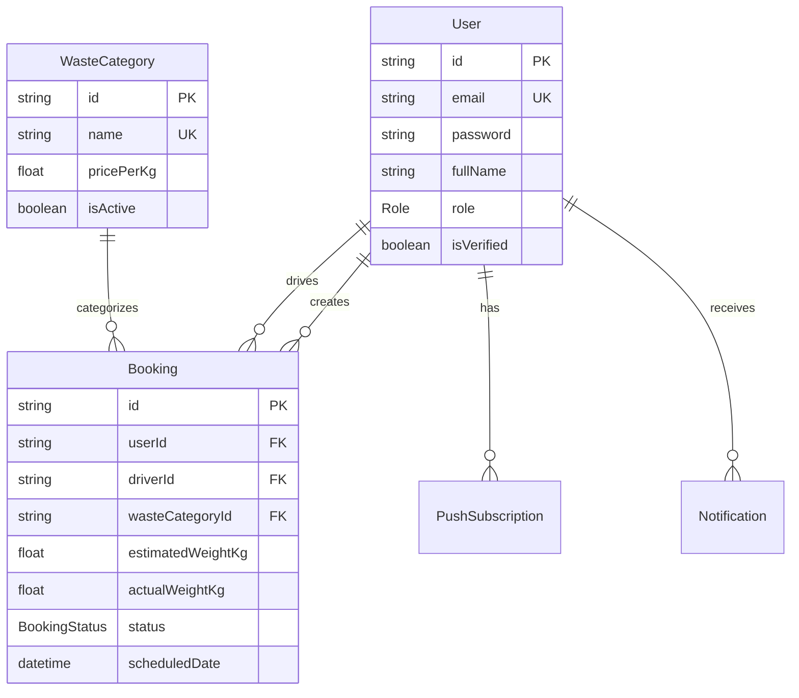

## Overview

Trash2Cash uses [Prisma](https://www.prisma.io/) as the ORM with PostgreSQL as the database.

## Prisma Setup

```typescript
// src/prisma/prisma.service.ts
import { Injectable, OnModuleInit, OnModuleDestroy } from "@nestjs/common";
import { PrismaClient } from "@prisma/client";

@Injectable()
export class PrismaService
  extends PrismaClient
  implements OnModuleInit, OnModuleDestroy
{
  async onModuleInit() {
    await this.$connect();
  }

  async onModuleDestroy() {
    await this.$disconnect();
  }
}
```

## Database Schema

### User Model

```prisma
// prisma/schema.prisma
model User {
  id              String    @id @default(uuid())
  email           String    @unique
  password        String
  fullName        String
  phone           String?
  address         String?
  role            Role      @default(USER)
  isVerified      Boolean   @default(false)
  verificationOtp String?
  createdAt       DateTime  @default(now())
  updatedAt       DateTime  @updatedAt

  bookings        Booking[]
  driverBookings  Booking[] @relation("DriverBookings")
  subscriptions   PushSubscription[]
  notifications   Notification[]
}

enum Role {
  USER
  ADMIN
  DRIVER
}
```

### Booking Model

```prisma
model Booking {
  id                 String        @id @default(uuid())
  userId             String
  driverId           String?
  wasteCategoryId    String
  estimatedWeightKg  Float
  actualWeightKg     Float?
  estimatedMinAmount Float
  estimatedMaxAmount Float
  finalAmount        Float?
  address            String
  latitude           Float?
  longitude          Float?
  scheduledDate      DateTime
  status             BookingStatus @default(PENDING)
  notes              String?
  createdAt          DateTime      @default(now())
  updatedAt          DateTime      @updatedAt

  user           User          @relation(fields: [userId], references: [id])
  driver         User?         @relation("DriverBookings", fields: [driverId], references: [id])
  wasteCategory  WasteCategory @relation(fields: [wasteCategoryId], references: [id])
}

enum BookingStatus {
  PENDING
  CONFIRMED
  ASSIGNED
  IN_PROGRESS
  COMPLETED
  CANCELLED
}
```

### Waste Category Model

```prisma
model WasteCategory {
  id          String    @id @default(uuid())
  name        String    @unique
  description String?
  pricePerKg  Float
  isActive    Boolean   @default(true)
  createdAt   DateTime  @default(now())
  updatedAt   DateTime  @updatedAt

  bookings    Booking[]
}
```

### Notification Models

```prisma
model PushSubscription {
  id        String   @id @default(uuid())
  userId    String
  endpoint  String   @unique
  keys      Json
  createdAt DateTime @default(now())

  user      User     @relation(fields: [userId], references: [id])
}

model Notification {
  id        String   @id @default(uuid())
  userId    String
  title     String
  body      String
  data      Json?
  isRead    Boolean  @default(false)
  createdAt DateTime @default(now())

  user      User     @relation(fields: [userId], references: [id])
}
```

## Entity Relationship Diagram



## Migrations

### Generate Migration

```bash
npx prisma migrate dev --name migration_name
```

### Apply Migrations

```bash
npx prisma migrate deploy
```

### Reset Database

```bash
npx prisma migrate reset
```

## Seeding

```typescript
// prisma/seed.ts
import { PrismaClient } from "@prisma/client";
import * as bcrypt from "bcrypt";

const prisma = new PrismaClient();

async function main() {
  // Create waste categories
  const categories = [
    { name: "Plastic", pricePerKg: 50.0 },
    { name: "Paper", pricePerKg: 30.0 },
    { name: "Metal", pricePerKg: 100.0 },
    { name: "Glass", pricePerKg: 25.0 },
    { name: "E-Waste", pricePerKg: 150.0 },
  ];

  for (const cat of categories) {
    await prisma.wasteCategory.upsert({
      where: { name: cat.name },
      update: {},
      create: cat,
    });
  }

  // Create admin user
  const adminPassword = await bcrypt.hash("admin123", 10);
  await prisma.user.upsert({
    where: { email: "admin@trash2cash.lk" },
    update: {},
    create: {
      email: "admin@trash2cash.lk",
      password: adminPassword,
      fullName: "Admin User",
      role: "ADMIN",
      isVerified: true,
    },
  });

  console.log("Seeding complete!");
}

main()
  .catch(console.error)
  .finally(() => prisma.$disconnect());
```

Run seeding:

```bash
npx prisma db seed
```

## Prisma Studio

Launch visual database browser:

```bash
npx prisma studio
```

## Query Examples

### Find with Relations

```typescript
const booking = await this.prisma.booking.findUnique({
  where: { id },
  include: {
    user: { select: { fullName: true, email: true, phone: true } },
    driver: { select: { fullName: true, phone: true } },
    wasteCategory: true,
  },
});
```

### Filter and Paginate

```typescript
const bookings = await this.prisma.booking.findMany({
  where: {
    userId,
    status: { in: ["PENDING", "CONFIRMED"] },
  },
  orderBy: { createdAt: "desc" },
  skip: (page - 1) * limit,
  take: limit,
});
```

### Aggregate

```typescript
const stats = await this.prisma.booking.aggregate({
  where: { status: "COMPLETED" },
  _sum: { finalAmount: true, actualWeightKg: true },
  _count: true,
});
```

## Related Pages

<CardGroup cols={2}>
  <Card title="Modules" icon="cubes" href="/server/modules">
    NestJS module structure.
  </Card>
  <Card title="Authentication" icon="lock" href="/server/authentication">
    JWT authentication.
  </Card>
</CardGroup>
